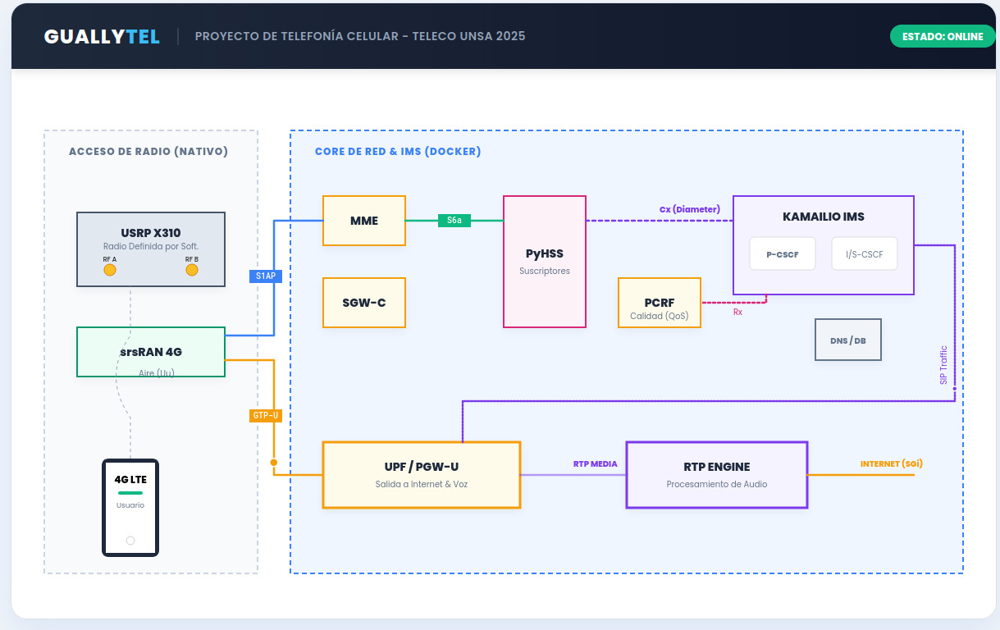

# 🚀 Red 4G LTE/VoLTE con Open5GS, Kamailio & srsRAN (Dockerizada) - GuallyTel


## 📖 Descripción General

Este proyecto ("GuallyTel") implementa una red móvil completa **4G LTE/VoLTE** utilizando herramientas de software libre y Radio Definida por Software (SDR).

A diferencia de despliegues estándar, esta arquitectura integra **Wowza Streaming Engine** para demostrar capacidades reales de **IPTV y streaming** sobre el plano de usuario LTE, además de servicios de **VoLTE y SMS**.

El núcleo de la red (EPC) y el subsistema IMS están contenerizados usando **Docker**, proporcionando un entorno modular y reproducible, mientras que la Red de Acceso (RAN) está impulsada por **srsRAN** conectado a un **Ettus USRP X310**.

---

## 🏗️ Arquitectura de la Red

El sistema se divide en dos bloques principales:

1. **Acceso de Radio (Nativo/SDR):** USRP X310 + srsRAN.
2. **Core de Red & IMS (Docker):** Contenedores gestionando el control y datos.



### Componentes Clave

- **Core:** Open5GS (MME, HSS, SGW/UPF, PGW, PCRF + WebUI).
- **IMS:** Kamailio (P-CSCF, I-CSCF, S-CSCF) para VoLTE y señalización SIP.
- **RAN:** srsRAN 4G actuando como eNodeB.
- **Servicios:** PyHSS para gestión avanzada de suscriptores y Wowza para Streaming.


## 🛠️ Requisitos de Hardware

| Componente | Especificación | Función |
|------------|----------------|---------|
| **Host PC** | Ryzen 7 7435HS, 16GB RAM, Ubuntu 24.04 LTS | Ejecuta Docker y srsRAN |
| **SDR** | **Ettus USRP X310** (1GbE/10GbE) | Interfaz de radio LTE |
| **Tarjetas SIM**| **OYEITIMES** USIM programables | Autenticación de usuarios |
| **Programador**| Lector Smart Card **PC/SC** | Personalización de SIMs |
| **UE** | S24 Ultra / Poco F7 | Dispositivos de usuario |


## ⚙️ Configuración de Red

Se separa el tráfico interno del laboratorio (Docker) del enlace físico SDR:

- **Red Docker (Bridge):** `172.22.0.0/24` (EPC/IMS/Servicios)
- **Enlace Físico SDR:** `192.168.10.0/24` (Host <-> USRP)


### 📌 Tabla de IPs y Puertos (referencial)

| Servicio | IP del Contenedor | Puertos principales | Rol |
|----------|-------------------|--------------------|-----|
| **MME** | `172.22.0.x` | `36412/SCTP` | S1-MME (control plane) |
| **HSS/DB/PyHSS** | `172.22.0.x` | `Diameter` / `MongoDB` / `REST` | Abonados LTE/IMS |
| **SGW/UPF** | `172.22.0.x` | `2123/UDP` + `2152/UDP` | GTP-C / GTP-U |
| **IMS (Kamailio)** | `172.22.0.x` | `5060/TCP/UDP` | SIP/IMS |
| **Wowza** | `172.22.0.x` | `1935/TCP` + `8086-8088/TCP` | RTMP/HLS + panel |


## 📁 Estructura del repositorio

| Archivo/Carpeta | Descripción |
|---|---|
| `4g-volte-deploy.yaml` | Core LTE (Open5GS + DB + WebUI, etc.) |
| `ims-deploy.yaml` | IMS (Kamailio: P-/I-/S-CSCF y dependencias) |
| `srsenb.yaml` / `srsran/` | eNodeB (si lo corres en contenedor) y configs |
| `wowza.yaml` | Wowza Streaming Engine (VOD + RTMP→HLS) |
| `.env` | Variables de entorno (sin secretos reales) |
| `docs/` | Diagramas, capturas, evidencias |

---

## 🚀 Instalación y Uso (paso a paso)

### 1️⃣ Prerrequisitos (Ubuntu 24.04)

```bash
sudo apt update && sudo apt upgrade -y
sudo apt install -y git curl vim net-tools iproute2 python3-pip
````

### 1.1 Docker (Engine + Compose)

> Si ya tienes Docker, salta a la verificación.

```bash
# Instalar dependencias
sudo apt install -y ca-certificates curl gnupg lsb-release

# Keyring
sudo install -m 0755 -d /etc/apt/keyrings
curl -fsSL https://download.docker.com/linux/ubuntu/gpg | sudo gpg --dearmor -o /etc/apt/keyrings/docker.gpg
sudo chmod a+r /etc/apt/keyrings/docker.gpg

# Repo oficial
echo \
  "deb [arch=$(dpkg --print-architecture) signed-by=/etc/apt/keyrings/docker.gpg] https://download.docker.com/linux/ubuntu \
  $(. /etc/os-release && echo $VERSION_CODENAME) stable" | \
  sudo tee /etc/apt/sources.list.d/docker.list > /dev/null

# Instalar Docker + Compose plugin
sudo apt update
sudo apt install -y docker-ce docker-ce-cli containerd.io docker-buildx-plugin docker-compose-plugin

# Habilitar servicio
sudo systemctl enable --now docker
```

Verificar:

```bash
docker --version
docker compose version
sudo docker run --rm hello-world
```

(Opcional) usar Docker sin sudo:

```bash
sudo usermod -aG docker $USER
newgrp docker
```

---

### 1.2 UHD (Drivers para USRP X310)

```bash
sudo add-apt-repository ppa:ettusresearch/uhd -y
sudo apt update
sudo apt install -y uhd-host libuhd-dev

# Descargar imágenes FPGA
sudo /usr/lib/uhd/utils/uhd_images_downloader.py
```

---

### 2️⃣ Configurar enlace Host ↔ USRP (IP estática)

> Cambia `eth1` por tu interfaz real (usa `ip a` para verla).

```bash
# Asignar IP al host en la subred SDR
sudo ip addr add 192.168.10.1/24 dev eth1
sudo ip link set eth1 up

# Verificar
ip a | grep 192.168.10
ip route | grep 192.168.10
```

---

### 3️⃣ Verificar USRP (UHD)

```bash
uhd_find_devices
uhd_usrp_probe
```

---

## 🔧 Configuración (.env)

Crea un archivo `.env` local.

```bash
cat > .env << 'EOF'
# Identidad de red (EJEMPLO)
MCC=001
MNC=01

# Red interna docker (si colisiona con tu LAN, cámbiala)
TEST_NETWORK=172.22.0.0/24

# IP del host (usada por el eNB o para advertise IPs)
DOCKER_HOST_IP=<IP_DEL_HOST>

# Advertise IP (si corresponde en tu arquitectura CUPS)
SGWU_ADVERTISE_IP=<IP_DEL_HOST>
UPF_ADVERTISE_IP=<IP_DEL_HOST>

# DNS/APN (ejemplo)
APN_INTERNET=internet
APN_IMS=ims
EOF
```

Recomendado: ignora el `.env` en git.

```bash
grep -qxF ".env" .gitignore || echo ".env" >> .gitignore
grep -qxF "*.pcap" .gitignore || echo "*.pcap" >> .gitignore
grep -qxF "*.log" .gitignore || echo "*.log" >> .gitignore
```

---

## ▶️ Despliegue (orden recomendado)

### 1) Levantar Core LTE (EPC)

```bash
sudo docker compose -f 4g-volte-deploy.yaml up -d
docker ps
```

Logs del MME:

```bash
docker logs -f mme
```

### 2) Levantar IMS (Kamailio)

```bash
sudo docker compose -f ims-deploy.yaml up -d
docker ps
```

Logs:

```bash
docker logs -f kamailio
```

### 3) Levantar eNodeB (srsRAN)

#### Opción A: eNB nativo (recomendado para SDR)

Edita tu `enb.conf` (o equivalente) con:

* MCC/MNC (igual al core)
* IP del MME / bind address
* parámetros RF (frecuencia/ancho de banda/ganancias)

Ejemplo conceptual:

```ini
[enb]
enb_id = 0x19B
mcc = 001
mnc = 01
mme_addr = <IP_MME_O_HOST>
gtp_bind_addr = <IP_HOST_SDR_LINK>
s1c_bind_addr = <IP_HOST_SDR_LINK>

[rf]
# Ajusta según tu banda/entorno
dl_earfcn = <EARFCN>
nof_prb = <PRB>
tx_gain = <TX_GAIN>
rx_gain = <RX_GAIN>
```

Ejecutar:

```bash
sudo srsenb /etc/srsran/enb.conf
```

#### Opción B: eNB dockerizado

```bash
sudo docker compose -f srsenb.yaml up -d
docker logs -f srsenb
```

---

### 4) Levantar Wowza (Streaming)

```bash
sudo docker compose -f wowza.yaml up -d
docker ps
```

Panel (ejemplo):

* `http://<WOWZA_HOST>:8088`

---

## 📲 SIMs (OYEITIMES) y abonados

### 1) Programación de SIM (OYEITIMES)

Se programan USIM reescribibles con herramienta OYEITIMES + lector PC/SC.

**Campos típicos:**

* IMSI
* MCC/MNC
* Ki / OPc (**NO publicar**)
* Dominio IMS (si usarás VoLTE)

Ejemplo publicable:

| SIM  | IMSI    |  MSISDN | APN data   | APN IMS |
| ---- | ---------------- | ------: | ---------- | ------- |
| SIM1 | `001010000010001` | `10001` | `internet` | `ims`   |
| SIM2 | `001010000010002` | `10002` | `internet` | `ims`   |


## 👤 Provisionando abonados (Open5GS WebUI / PyHSS)

### Opción A: Open5GS WebUI

1. Entra a WebUI (ej: `http://localhost:9999`)
2. Crea subscribers LTE con IMSI/MSISDN y APNs (`internet`, `ims`)
3. Verifica attach en logs del MME

### Opción B: PyHSS (API / Swagger)

Swagger típico:

* `http://<HOST_PYHSS>:8080/docs/`


**Crear APN (internet):**

```json
{
  "apn": "internet",
  "qci": 9
}
```

**Crear APN (ims):**

```json
{
  "apn": "ims",
  "qci": 5
}
```

**Crear AUC (AKA vectors):**

```json
{
  "imsi": "00101000001***",
  "iccid": "8988211************",
  "ki": "<KI_HEX_32>",
  "opc": "<OPC_HEX_32>",
  "amf": "8000",
  "sqn": 0
}
```

**Crear subscriber LTE:**

```json
{
  "imsi": "00101000001***",
  "msisdn": "10001",
  "auc_id": 1,
  "default_apn": 1,
  "apn_list": "1,2",
  "enabled": true
}
```

---

## ✅ Validación

| Prueba          | Qué mirar                      | Evidencia / comando          |
| --------------- | ------------------------------ | ---------------------------- |
| **S1 Setup**    | eNB se conecta al MME          | `docker logs mme`            |
| **Attach LTE**  | UE se registra                 | logs MME + eNB + pantalla UE |
| **Datos (PDN)** | UE obtiene IP / navega         | navegador / speedtest        |
| **GTP-U**       | tráfico encapsulado UDP/2152   | tcpdump + Wireshark          |
| **Llamadas**         | Llamadas entre MSISDN internos | UE ↔ UE                      |
| **SMS**         | mensajes entre MSISDN internos | UE ↔ UE                      |
| **Streaming**   | reproducción HLS               |  Wowza              |

Captura rápida de trafico GTP-U con el comando:

```bash
sudo tcpdump -i any udp port 2152 -w gtp_user.pcap
```

---

## 📺 Streaming con Wowza (VOD y Live)

### VOD (HLS)

* Coloca contenido en el directorio del contenedor (ej: `/content`)
* Habilita salida Apple HLS en la app VOD

### Live (RTMP → HLS)

1. Crea una app live (ej: `gojolive` o la que uses)
2. Publica desde OBS hacia Wowza (RTMP)
3. Consume HLS desde el UE

Plantillas de URL:

* **RTMP ingest:** `rtmp://<WOWZA_HOST>:1935/<APP_LIVE>`
* **HLS play:** `http://<WOWZA_HOST>:1935/<APP_LIVE>/<STREAM>.m3u8`

---

## 🧯 Troubleshooting

### eNB no conecta al MME (S1)

* Verifica `36412/SCTP` publicado
* Revisa rutas host↔docker↔eNB
* Firewall/UFW

```bash
ss -lpn | grep 36412
docker logs mme | tail -n 200
ip route
```

### Attach OK pero sin datos

* Revisa APN `internet`
* Confirma `2152/UDP` activo en SGW/UPF
* Captura GTP-U

### Streaming con delay alto

* Ajusta segmentación HLS en Wowza
* Reduce buffer del reproductor si aplica
* Revisa estabilidad radio y throughput

---

## ⚖️ Nota legal / ética

Proyecto de uso **académico y en entorno controlado**. No desplegar en bandas/licencias reales sin autorización.

---

